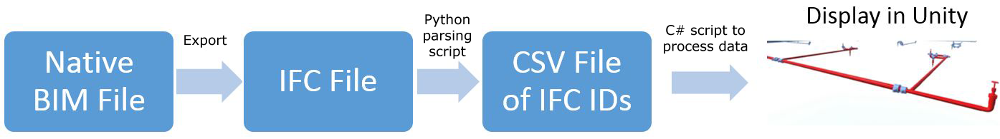

# Converting BIM to Virtual World for Facility Management Operations

This article summarizes my undergraduate thesis: converting Building Information Models (BIM) into virtual worlds for facility management (FM) operations. I submitted my thesis to the 2016 International Conference on Computing in Civil and Building Engineering (ICCCBE).  You can read my submission [here (PDF)](http://www.see.eng.osaka-u.ac.jp/seeit/icccbe2016/Proceedings/Full_Papers/096-262.pdf) or from my [repository](https://github.com/seumoo/writing-samples/blob/main/ICCCBE_2016_Publication.pdf).

**Technologies Used**: Autodesk Revit, Unity, Python, JavaScript, C#, SQL

## Table of Contents

  - [Background & Problem Statement](#background--problem-statement)
  - [Objective](#objective)
  - [Methodology](#methodology)
    - [Converting BIM into Unity](#converting-bim-into-unity)
    - [Adding Player Movement](#adding-player-movement)
    - [Connecting Live Data Feeds](#connecting-live-data-feeds)
    - [Integrating Equipment Interactions](#integrating-equipment-interactions)
    - [Detecting Pipe Segments for Fire Sprinklers](#detecting-pipe-segments-for-fire-sprinklers)
  - [Results](#results)

## Background & Problem Statement

Facilities management (FM) in buildings requires coordination of space, assets, and maintenance information for the building to run as cost-effective as possible. FM operations include:

- Maintaining inventory of physical assets, including mechanical and HVAC equipment
- Managing maintenance crews and tasks
- Utilizing sensors and computer systems to monitor building health

Since buildings have dynamic facility systems, monitoring building health in real-time is challenging. Managers may wait for information verification which increases facility-related expenditures. These situations stem from physical limitations like identifying faulty equipment in person and data discrepancies between equipment sensors and the environment. For example:

- Disturbing an office space when searching for problematic duct systems in a ceiling
- Faulty thermostat readings leading to room temperature issues

I researched virtual worlds for FM operations to help mitigate facility managers' physical and data limitations. A virtual world is a digital twin of a physical space rendered in a gaming engine. Converting BIM into a gaming engine allows you to integrate interactivity components, including physical movement, object interactivity, and database incorporation. These components are difficult or impossible to incorporate using standard BIM tools.

## Objective

The objective of my thesis is to use the Unity game engine to develop a virtual world of a 17-story facility and integrate interactive components for FM operations (Figure 1). Interactivity within the virtual world will help facility managers with day-to-day operations without being in the physical location, such as identifying faulty systems or viewing equipment data in real-time.

 

<figcaption><b>Figure 1: BIM to Unity workflow</b></figcaption>

 

In the virtual world, I developed the following interactions:

- First-person movement for users to navigate the facility
- Facility databases that stream real-time data of equipment, including sensors, thermostats, and HVAC units
- Interaction with equipment to display data from the database stream
- Pipe segment detection for fire sprinklers

Figure 2 shows a sample interaction with an air handling unit (AHU) where the interface displays real-time sensor data from the AHU. The following section explains my methodology for developing this virtual world.

 

<figcaption><b>Figure 2: Interaction with equipment in the virtual world</b></figcaption>

 

## Methodology

This section explains the methodology used to convert BIM into Unity and develop an interactive virtual world for FM operations.

### Converting BIM into Unity

The first step was converting the BIM into a file format that Unity accepts. Importing BIM files directly into Unity loses the model's textures and meta-data. However, importing an acceptable file format like FBX will retain the model's texture and data (Figure 3a). I used Autodesk 3ds Max to export the mechanical, structural, and architectural BIM files into FBX with textures, lighting, and meta-data. I exported the FBX files into Unity and verified that the model's textures, lighting, and meta-data were still intact (Figure 3b).

 

<figcaption><b>Figure 3: Model comparison based on import method</b></figcaption>

 

### Adding Player Movement

I utilized Unity assets to add player movement so players could navigate the virtual world. I developed JavaScript scripts to allow players to navigate the model from a first-person perspective. I added colliders to all model elements, including doors, walls, floors, and equipment. Colliders prevent players from walking through elements and another layer of realism to the virtual world.

Next, I developed scripts in Unity to connect to a database with live data feeds from sensors and facility equipment.

### Connecting Live Data Feeds

I completed the following steps to connect live data feeds into the virtual world (Figure 4):

1. Requested facility data from the facility's building automation systems (BAS) using REST requests
2. Stored BAS data into a SQL database so data can be imported into Unity
3. Developed C# scripts in Unity to connect the virtual world with the SQL database

Next, I developed scripts so players could interact with equipment and view data feeds.

<figcaption><b>Figure 4: Connecting BAS data into the virtual world</b></figcaption>

### Integrating Equipment Interactions

I developed a user interface (UI) in JavaScript to integrate equipment interactions to display equipment data from the SQL database (Figure 5). The UI extracts the equipment's ID, queries the database via ID to return the equipment's readings and health status, and displays the equipment's information in a popup.

 

<figcaption><b>Figure 5: UI of an air handling unit</b></figcaption>

 

Next, I added a click event to all equipment in the virtual world, including HVAC units, mechanical systems, and sensors. When a player clicks on an equipment element, a popup will appear and display the equipment's live data feeds and health status (Figures 6 & 7).

 

<figcaption><b>Figure 6: Viewing equipment data in an office space</b></figcaption>

 

 

<figcaption><b>Figure 7: Viewing data from dedicated outdoor air systems (DOAS)  </b></figcaption>

 

### Detecting Pipe Segments for Fire Sprinklers

To establish relationships between flow systems such as pipe networks and their connections to valves, Industry Foundation Classes (IFC) data exported from the BIM was used. IFC is a BIM specification that establishes a model's entities and their properties within a model. Properties include physical attributes such as dimensions, spatial features such as the Cartesian coordinates, meta-data such as the entity's type, and relationships between other entities.

Figure 8 shows a sample of an IFC file and its contents. IFC IDs are unique randomly generated IDs given to each component in the model. IFC establishes flow systems under the IFCRELASSIGNSTOGROUP class, which contain IFC lines as its attributes. IFC lines refer to a specific element or element property such as:

-  `IFCFLOWFITTING`: describes a single entity such as a valve or 
-  `IFCDISTRUBUTIONPORT`: represents an inlet or outlet

 

<figcaption><b>Figure 8: Sample of IFC data</b></figcaption>

 

To convert textual IFC relationships into interactive flow systems within the virtual world, I developed Python and C# scripts to parse IFC data and link flow systems (Figure 9). 

 

<figcaption><b>Figure 9: Process of integrating IFC relationships into the virtual world</b></figcaption>

 

I wrote a Python script to parse all flow system relationships in the IFC file. The script looks at all the IFC Lines contained in the class IFCRELASSIGNSTOGROUP, which defines a relationship, and extracts the IFC ID of each component into a list. The list defines rows as individual IFC relationships and columns as IFC IDs belonging to that relationship (Table 1).

**Table 1: Sample of pipe system relationships using IFC IDs**

|                    | **ID #1** | **ID #2** | **ID #3** |
|--------------------|:---------:|:---------:|:---------:|
| **Relationship 1** |    123    |    456    |           |
| **Relationship 2** |    789    |    1011   |    1213   |
| **Relationship 3** |    1415   |    1617   |           |

Next, I wrote C# scripts in Unity to establish system relationships by linking game model components to the relationships based on the CSV data (Figure 10). The script searches for any pipe or valve element containing the IFC ID for each relationship list. The element with the matching ID is stored `List<GameObject>` with other elements in the relationship.

 

<figcaption><b>Figure 10: C# script steps for linking IFC relationships in Unity </b></figcaption>

 

When the player clicks on a valve, a popup will appear, allowing the player to highlight all connecting pipes from the valve (Figures 11 & 12). This highlight feature is helpful for facility managers to track pipes for maintenance or troubleshoot faulty valves.

 

<figcaption><b>Figure 11: Highlighting pipe systems from valves</b></figcaption>

 

 

<figcaption><b>Figure 12: Overhead view of a highlighted pipe system</b></figcaption>

 

## Results

My thesis research created a virtual world that helped facility managers streamline facility operations. Managers could interact with equipment to view real-time facility data and monitor equipment health without physically being at the site. Viewing equipment data remotely allowed facility managers to detect issues quickly and identify faulty systems. Integrating pipe system logic was also valuable for facility managers to identify defective pipe segments from valves.
